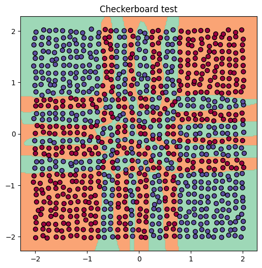

# vect-micrograd

<p align="center">
  
  
</p>

A vectorized extension of Andrej Karpathy's [micrograd](https://github.com/karpathy/micrograd).

The core idea is simple: keep the same dynamic DAG and reverse-mode autodiff, but let each `Value` node store a NumPy array instead of a Python scalar. A dense layer goes from thousands of scalar nodes to a handful of array ops — matmul, add, activation — without changing how the graph or the backward pass work. Does not support second order derivation.

---

## Design goals

- **Stay close to micrograd.** Same `Value` class, same `backward()`, same `_prev`/`_op` graph. Anyone who understands micrograd can read this.
- **No new dependencies.** NumPy only.
- **Keep it simple.** Broadcasting, matmul, and fused softmax/CE are the only genuinely hard parts. Everything else follows naturally.

---

## Installation

```bash
pip install -e .
```

Requires Python 3.10+ and NumPy.

---

## What changed from scalar micrograd

### `_unbroadcast`

Broadcasting is the trickiest part of array-valued autograd. When `b` has shape `(32,)` and `out = X + b` has shape `(200, 32)`, the gradient `dL/db` must be summed back from `(200, 32)` to `(32,)`. The helper `_unbroadcast` handles this by stripping prepended dimensions and summing stretched ones with `keepdims=True`.

### `__matmul__` backward

Explicitly implements the 2D dense-layer case and three vector variants. The common case is:

```
X @ W  where X.shape = (batch, in),  W.shape = (in, out)

dL/dX = dL/dY @ W.T
dL/dW = X.T @ dL/dY
```

Higher-dimensional batched matmul is intentionally unsupported — it would add complexity without educational value.

### Fused `softmax_ce`

Softmax and cross-entropy are computed together as a single graph node. Computing them separately would accumulate numerical error across log and sum nodes. The fused backward gradient is `(probs − targets) / batch`, the standard result. This is the same approach PyTorch uses internally for `F.cross_entropy`.

### Optimizer class

`SGD` and `Adam` share an `Optimizer` base class with a built-in linear learning rate schedule:

```python
optimizer = SGD(model.parameters(), lr=1.0, total_steps=1000)
# or
optimizer = Adam(model.parameters(), lr=1e-2, total_steps=1000)
```

Swapping optimizers is one line. The schedule decays the learning rate linearly to 10% of its initial value by the final step.

### He (Kaiming, 2015) initialisation and activation parameter

`Layer` uses He initialisation (`W ~ N(0, sqrt(2/nin))`), the correct default for ReLU networks. `MLP` accepts an `activation` parameter:

```python
MLP(2, [16, 16, 3])                          # ReLU (default)
MLP(2, [16, 16, 3], activation=Value.tanh)   # tanh
```

---

## Package structure

```
vect_micrograd/
    vect_engine.py   # Value class, autograd primitives
    vect_nn.py       # Module, Layer, MLP 
    optim.py           # Optimizer, SGD, Adam 
    utils.py           # Loss functions and checkpointing 
tests/
    test_value.py  # Numerical gradient checks and unit tests
```

Total: ~340 lines not including comments nor docstrings.

---

## Comparison with similar projects

Several projects have extended micrograd to support arrays. Here is how this one differs.

### [ITI-THM/micrograd-np](https://github.com/ITI-THM/micrograd-np)
Around 900 lines with extensive documentation explaining the math, Xavier initialisation, and Graphviz integration for computational graph visualisation. More complete and more documented, but nearly twice as long. No optimizer class; training loops are written by hand. No fused softmax/CE.

### [srkds/Micrograd-Autograd-Engine-implementation](https://github.com/srkds/Micrograd-Autograd-Engine-implementation)
Supports vectorization and broadcasting but has a known issue: when you train with a given batch shape, the Value object broadcasts to that shape, and passing a different-sized test set gives an error. `_unbroadcast` in `vect-micrograd` avoids this class of bug entirely.

### [brief-ds/micrograd](https://github.com/brief-ds/micrograd)
Relaxes PyTorch's requirement that backward starts from a scalar, initialising instead with an all-ones tensor of the expression's result shape, and introduces a `forward()`/`backward()` split with lazily defined variables. A different design philosophy — more declarative, but further from the original micrograd interface.

### [MicrogradPlus](https://github.com/Johnnykoch02/MicrogradPlus)
Aims to fill the educational gap between micrograd and tinygrad by showing how the transition from scalar to vectorized gradients should be handled. Closest in stated goal. No optimizer abstraction, no fused loss, no test suite.

## Demos

**`vect_demo.ipynb`** — checkerboard binary classification with SVM loss and L2 regularisation. Shows checkpointing and best-model recovery.

**`spiral_demo.ipynb`** — three-class spiral classification with softmax cross-entropy loss.

---

## Running tests

```bash
pip install pytest
pytest tests/test_value.py -v
```

Tests include numerical gradient checks for matmul, fused softmax/CE, and all engine primitives.

## License

MIT.
